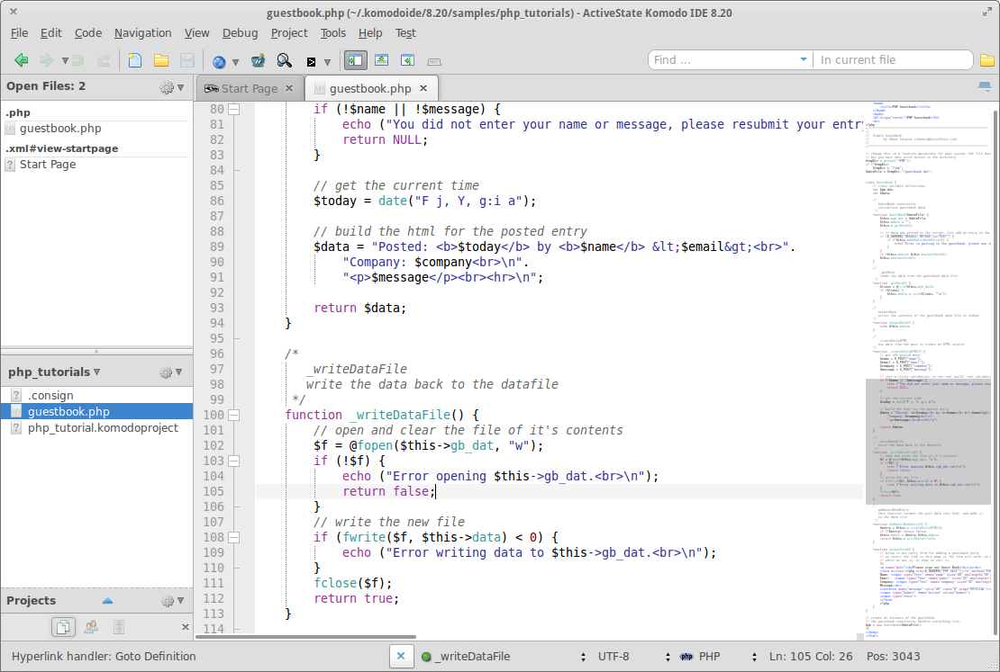

Building Addon
==============

To build this addon please refer to the documentation on building an extension:

http://community.activestate.com/forum/introduction-building-komodo-extension

Note that Komodo skins need to be built using the --unjarred flag, ie.

  koext build --unjarred

Once you have built and installed your own version of this skin you can activate it
under Preferences > Appearance > Skin.

Note that if you were already using this skin prior to installing your own version
you will need to switch back and forth between another skin in order to apply
your own version.
